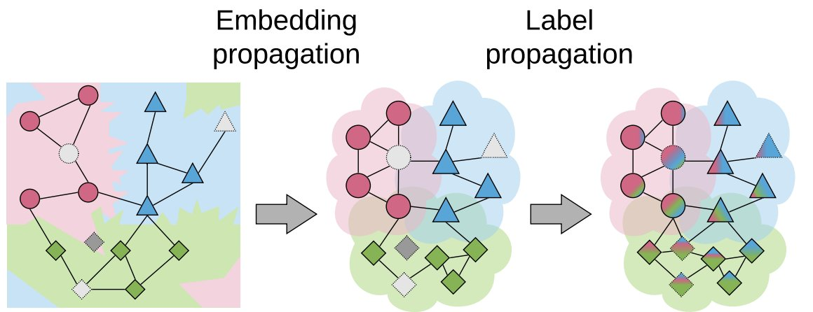

[](https://opensource.org/licenses/Apache-2.0)


<h1 align="center">Embedding Propagation </h1>
<h5 align="center">Smoother Manifold for Few-Shot Classification <a href="https://arxiv.org/abs/2003.04151">[Paper]</a> </h5> 


Embedding propagation can be used to regularize the intermediate features so that generalization performance is improved.



## Usage

Add an embedding propagation layer to your network.

```
pip install git+https://github.com/ElementAI/embedding-propagation
```

```python
import torch
from embedding_propagation import EmbeddingPropagation

ep = EmbeddingPropagation()
features = torch.randn(32, 32)
embeddings = ep(features)
```

## Experiments 

Generate the results from the <a href="https://arxiv.org/abs/2003.04151">[Paper]</a>.

### Install requirements

`pip install -r requirements.txt`
 
This command installs the [Haven library](https://github.com/IssamLaradji/haven) which helps in managing the experiments.

### Download the Datasets

* [mini-imagenet](https://github.com/renmengye/few-shot-ssl-public#miniimagenet) ([pre-processing](https://github.com/ElementAI/TADAM/tree/master/datasets))
* [tiered-imagenet](https://github.com/renmengye/few-shot-ssl-public#tieredimagenet)
* [CUB](https://github.com/wyharveychen/CloserLookFewShot/tree/master/filelists/CUB)

If you have the `pkl` version of miniimagenet, you can still use it by setting the dataset name to "episodic_miniimagenet_pkl", in each of the files in `exp_configs`.

<!-- You can either edit `data_root` in the `exp_configs/[pretraining|finetuning].py` or create a symbolic link to the each of the dataset folders at `./data/dataset-name/` (default). -->

### Reproduce the results in the paper

#### 1. Pre-training

```
python3 trainval.py -e pretrain -sb ./logs/pretraining -d <datadir>
```
where `<datadir>` is the directory where the data is saved.

#### 2. Fine-tuning

In `exp_configs/finetune_exps.py`, set `"pretrained_weights_root": ./logs/pretraining/`

```
python3 trainval.py -e finetune -sb ./logs/finetuning -d <datadir>
```

#### 3. SSL experirments with 100 unlabeled

In `exp_configs/ssl_exps.py`, set `"pretrained_weights_root": ./logs/finetuning/`

```
python3 trainval.py -e ssl_large -sb ./logs/ssl/ -d <datadir>
```

#### 4. SSL experirments with 20-100% unlabeled

In `exp_configs/ssl_exps.py`, set `"pretrained_weights_root": ./logs/finetuning/`

```
python3 trainval.py -e ssl_small -sb ./logs/ssl/ -d <datadir>
```

### Results

|dataset|model|1-shot|5-shot|
|-------|-----|------|------|
|episodic_cub|conv4|65.94 ± 0.93|78.80 ± 0.64|
|episodic_cub|resnet12|81.32 ± 0.84|91.02 ± 0.44|
|episodic_cub|wrn|87.48 ± 0.68|93.74 ± 0.35|
|episodic_miniimagenet|conv4|57.41 ± 0.85|72.35 ± 0.62|
|episodic_miniimagenet|resnet12|64.82 ± 0.89|80.59 ± 0.64|
|episodic_miniimagenet|wrn|69.92 ± 0.81|83.64 ± 0.54|
|episodic_tiered-imagenet|conv4|58.63 ± 0.92|72.80 ± 0.78|
|episodic_tiered-imagenet|resnet12|75.90 ± 0.90|86.83 ± 0.58|
|episodic_tiered-imagenet|wrn|78.46 ± 0.90|87.46 ± 0.62|

Different from the paper, these results were obtained on a run with fixed hyperparameters during fine-tuning: lr=0.001, alpha=0.2 (now default), train_iters=600, classification_weight=0.1

## Citation
```
@article{rodriguez2020embedding,
  title={Embedding Propagation: Smoother Manifold for Few-Shot Classification},
  author={Pau Rodríguez and Issam Laradji and Alexandre Drouin and Alexandre Lacoste},
  year={2020},
  journal={arXiv preprint arXiv:2003.04151},
}
```
